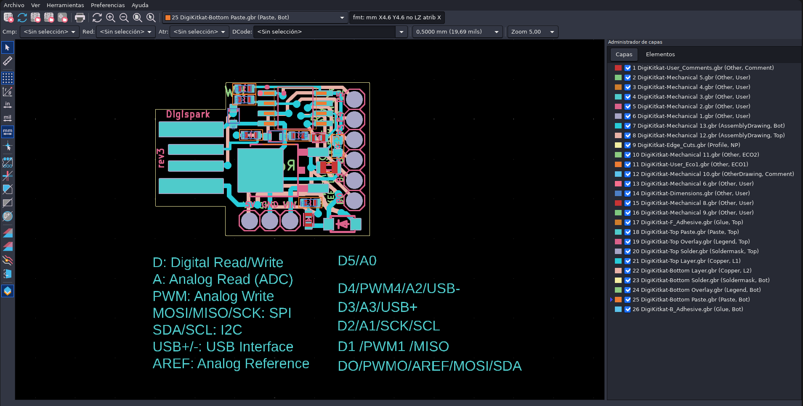
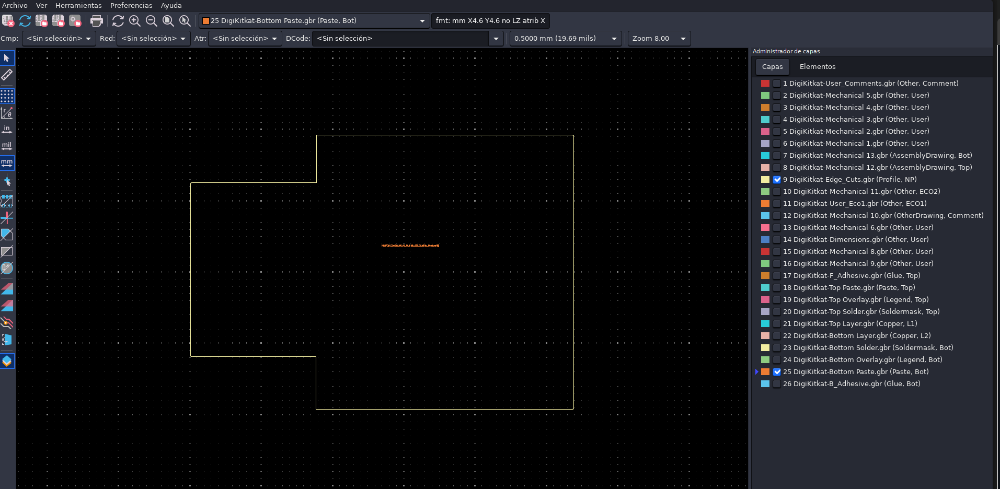
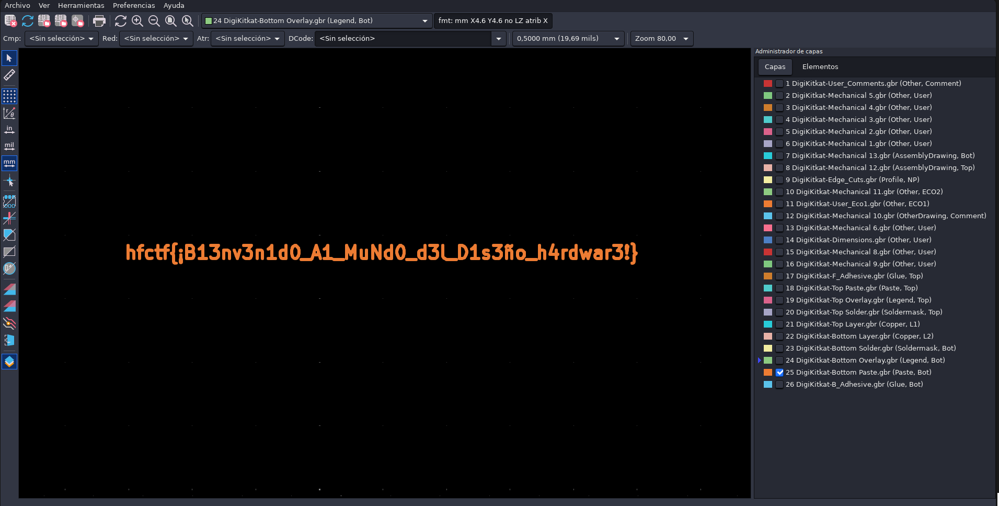

Nombre del reto: DigiKitcat.

Autor del reto: `kesero`

Dificultad: Fácil

## Enunciado

" Mi gran amigo Joe Grand ha diseñado un dispositivo hardware capaz de realizar ataques de Keylogging.
Me ha dicho que ha guardado una sorpresa en él, pero no tengo ni idea de esto del hardware.
¿Me ayudas? "

## Archivos

En el reto, nos dan la siguiente carpeta.

- `gerber/` : Contiene los archivos .gbr

## Analizando el reto

En este reto tenemos una carpeta `Gerber` la cual contiene archivos `.gbr`. Este tipo de archivos son utilizados a la hora de realizar placas de circuitos impresos (PCBs). Estos archivos deben abrirse en un conjunto con aplicaciones dedicadas ya que contribuyen individualmente a la representación visual de la PCB por capas.

Hay numerosas aplicaciones en las que podemos visualizar dichos archivos, como por ejemplo`KiCad`, `Gerbv`, `EasyEDA`, `PCBWay`, `ViewMate` o directamente con visualizadores online.

## Solución

Este reto trata de visualizar el diseño lógico de un circuito impreso, en este caso estamos tratando de la famosa `DigiSpark`.
Para ello tendremos que navegar entre las capas que conforman dicha PCB en busca de la flag. Esto lo podemos realizar con numerosas herramientas, como he mencionado anteriormente.

La manera más sencilla de manipular estos archivos es con la aplicación `KiCad` ya que es gratuita y se instala de forma sencilla.

    ┌──(kesero㉿kali)-[~]
    └─$ sudo apt install kicad

Una vez instalada, abriremos la aplicación y nos iremos a `Visor Gerber`, y se nos abrirá una pestaña con todas las capas que conforman nuestra circuito impreso.

En este punto tendremos que navegar entre las distintas capas del circuito y es en la capa `Bottom Paste` donde se encuentra nuestra flag.

## Flag

`hfctf{¡B13nv3n1d0_A1_MuNd0_d3l_D1s3ño_h4rdwar3!}`